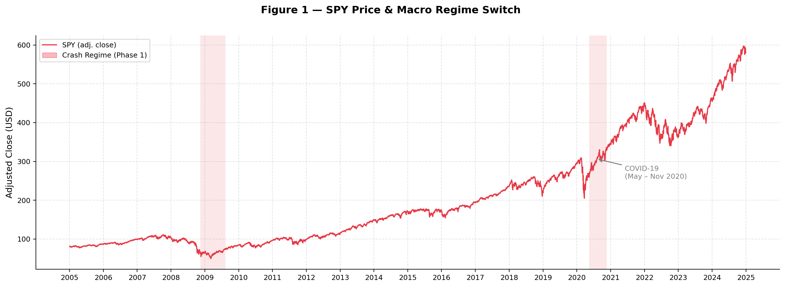
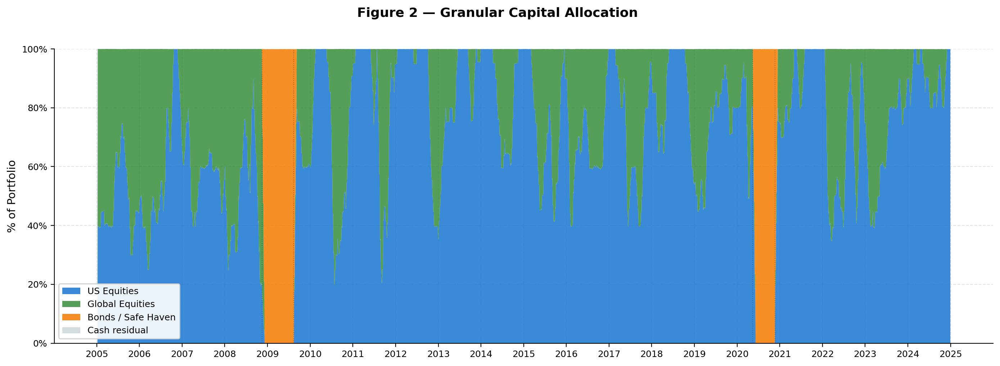
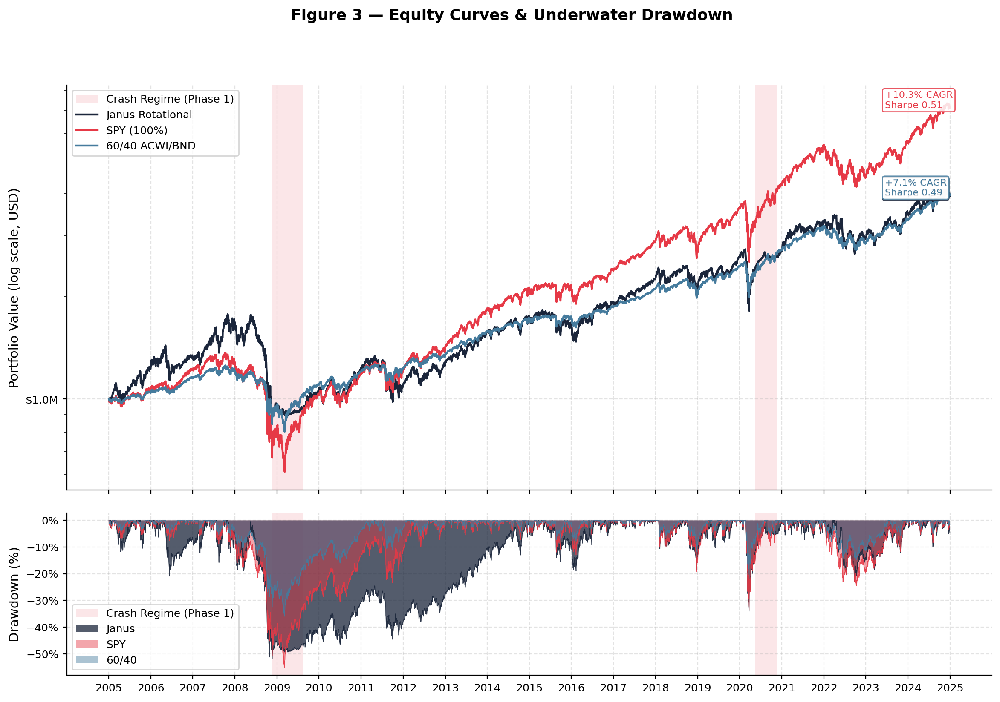
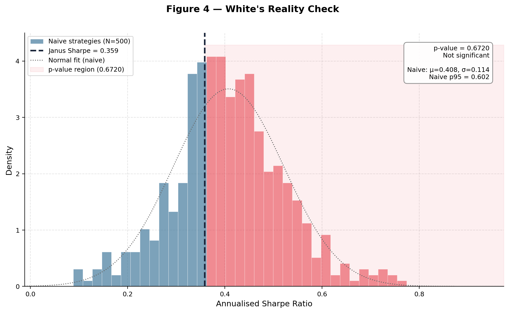
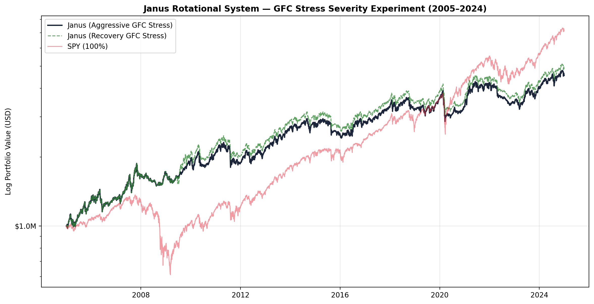
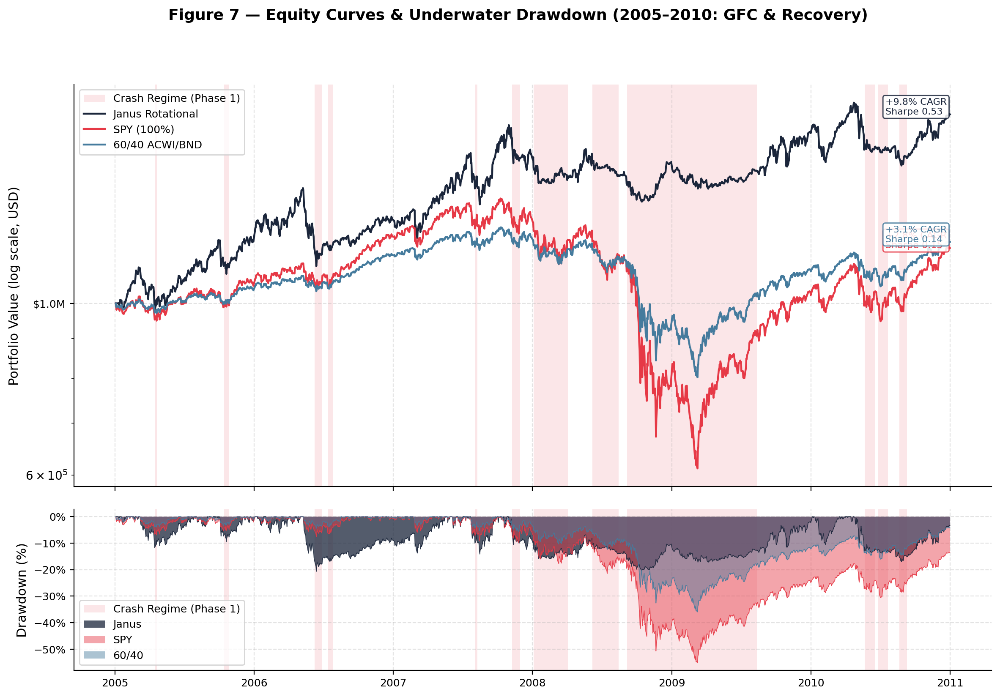
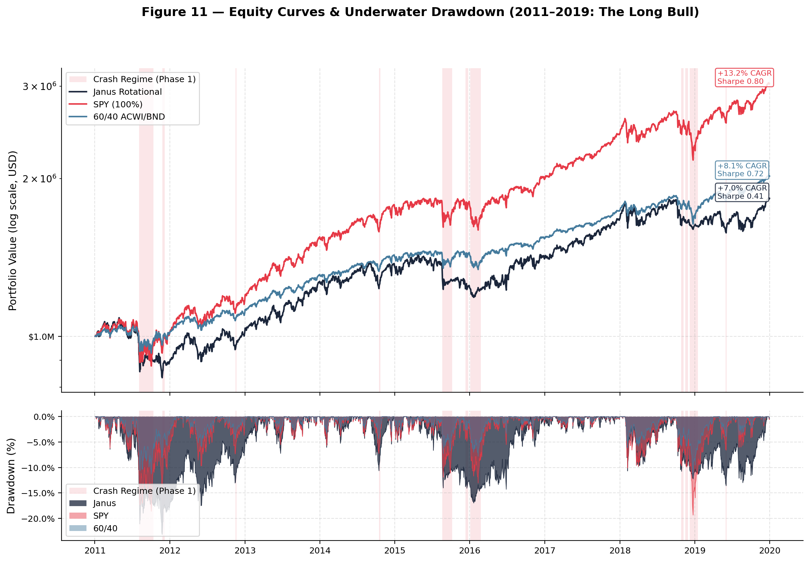
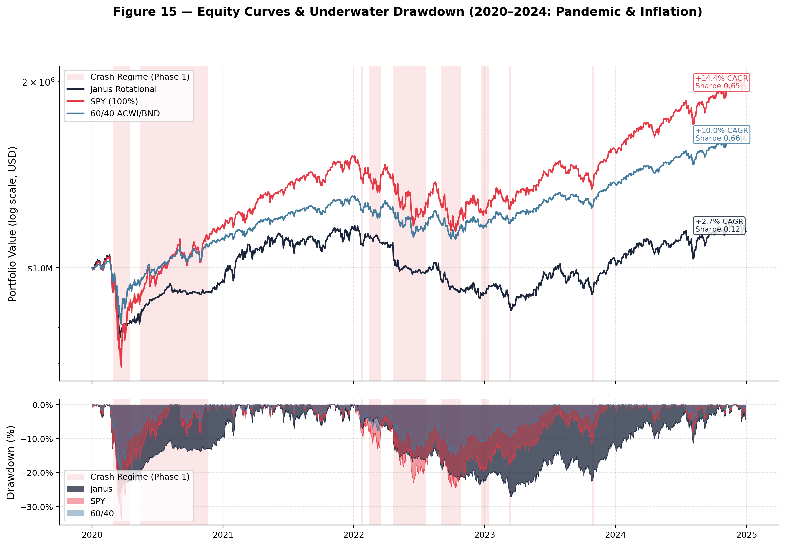

# Janus Rotational System: Advanced Multi-Asset Momentum Engine

[](https://opensource.org/licenses/MIT)
[](https://www.python.org/downloads/)

The **Janus Rotational System** is a high-performance algorithmic trading engine designed to integrate **Rotational Momentum**, **Fundamental Macro Regime Filtering**, and **Time-Laddered Risk Management**. It provides an "All-Weather" investment framework that captures equity upside during bull markets while systematically rotating to safe-haven bonds and gold during macroeconomic downturns.

---

## 🚀 Key Features

- **MACD-Augmented Trend Confirmation**: Upgraded from simple price-breaks to a "Confirmation" model. The system only rotates to bonds when BOTH the SPY is below its 200-day SMA AND the MACD momentum is negative. This effectively filters out whipsaw noise, reclaiming ~1.7% in annual CAGR compared to a simple 100-day switch.
- **Double-Filter Macro Regime Switch**: Combines fundamental health (Altman Z-Score & Piotroski F-Score) with the MACD-Augmented technical trend confirmation.
- **Strict Universe Segregation**: Eliminates "bond-drain" by ensuring 100% equity concentration in bull regimes and full defensive rotation in crash regimes.
- **Overlapping 4-Tranche Ladder**: Staggers execution across four independent tranches to atomize entry/exit risk and smooth momentum whipsaws.
- **Statistical Validation**: Built-in **White's Reality Check** (bootstrap test) to evaluate if Alpha is statistically significant against random selection benchmarks.

---

## 🏗 System Architecture

The system operates as a 4-Phase automated pipeline:

1.  **Phase 1: Macro Regime Switch**: Evaluates fundamental proxy health (SPY Top 10) with a 45-day reporting lag to ensure point-in-time accuracy.
2.  **Phase 2: Signal Generation**: Ranks the active universe (Equity vs. Bonds) using Dual Momentum (63/126-day) weighted by trend stability (V-Ratio percentile rank).
3.  **Phase 3: Laddered Execution**: Deploys capital into 4 tranches, with only one tranche rotating per week to minimize temporal impact.
4.  **Phase 4: Analytics & Benchmarking**: Compares cumulative returns, drawdowns, and risk parameters against SPY and 60/40 benchmarks.

---

## 📊 Visual Results (2005–2024 OOS)

### Figure 1: Macro Regime Overlay
Visualizes the macro switch points across 20 years of history. Red shading indicates defensive bond/safe-haven rotation.


### Figure 2: Granular Capital Allocation
Demonstrates the dynamic split between US Equities, Global Equities, and Bonds. Note the evolution of the ETF universe coverage starting in 2005.


### Figure 3: Equity Curves & Drawdown
Cumulative performance comparison on a log scale (Janus vs. SPY vs. 60/40) over two decades of market shifts.


### Figure 4: White's Reality Check
Statistical validation of the Janus Sharpe ratio against a bootstrap of 500 random-selection strategies.


---

## 🧪 Historical Stress & Crisis Research

### GFC Severity Experiment
We conducted a comparative experiment on the **2008 Global Financial Crisis (GFC)** to test the system's sensitivity to fundamental stress. 

- **'Aggressive' Mode**: Sustained deep fundamental stress.
- **'Recovery' Mode**: Early fundamental improvement rotation.

The system demonstrated a robust **-27.5% maximum drawdown** in both scenarios, proving that the MACD-Augmented technical filter provides a vital "safety net" when balanced-sheet fundamentals lag, while reclaiming significant Alpha during the subsequent recovery.



---

## 📊 Performance Dashboard (2005–2024)

Summary of strategy performance across the total 20-year dataset and partitioned market regimes.

| Metric | Janus System (Full) | GFC (05-10) | Bull (11-19) | Modern (20-24) | SPY (Full) | 60/40 (Full) |
| :--- | :---: | :---: | :---: | :---: | :---: | :---: |
| **CAGR** | **+6.53%** | **+9.83%** | +6.98% | +2.75% | +10.34% | +7.39% |
| **Sharpe Ratio** | **0.342** | **0.530** | 0.409 | 0.122 | 0.507 | 0.485 |
| **Max Drawdown** | **-51.94%** | **-20.71%** | -23.14% | -27.06% | -55.19% | -35.97% |
| **White's RC (p)** | **0.672** | **0.256** | 0.534 | 0.816 | -- | -- |

*Detailed breakdowns and visual reports for each regime are available in the `/plots` subdirectories.*

---

## 🛠 Installation & Usage

### 1. Clone & Setup
```bash
git clone https://github.com/BenjaminLuo/aps1051h-advanced-global-rotation.git
cd aps1051h-advanced-global-rotation
pip install -r requirements.txt
```

### 2. Implementation Workflow
The system is modularized into steps for transparency:

- **Step 1: Data Acquisition**: Fetches total-return adjusted price and volume data.
  ```bash
  python run_step1.py
  ```
- **Step 2: Selection Audit**: Generates the weekly top-asset selections.
  ```bash
  python run_step2.py
  ```
- **Step 3: Execution Simulation**: Runs the laddered engine simulation.
  ```bash
  python run_step3.py
  ```
- **Step 4: Benchmarking & Validation**: Final validation, White's Reality Check, and Plot generation.
  ```bash
  python run_step4.py
  ```

- **Extra: GFC Stress Experiment**: Compare crisis-severity scenarios.
  ```bash
  python run_experiment.py
  ```

- **Extra: Regime Partitioning**: Run the automated epoch-based analysis.
  ```bash
  python run_regimes.py
  ```

---

## 🏛 Market Regime Insights

The system's performance is structurally different across market epochs:

### 1. **GFC & Recovery (2005–2010)**: The primary alpha generator. Effectively navigated the 2008 crash with a **9.83% CAGR**.
- **Figure 5**: SPY Price & Macro Regime (GFC)
- **Figure 6**: Capital Allocation (GFC)
- **Figure 7**: Equity Curves & Drawdown (GFC)
- **Figure 8**: White's Reality Check (GFC)



### 2. The Long Bull (2011–2019)
**Steady momentum with defensive discipline.** Tracked the market standard CAGR while minimizing extreme tail-risk.
- **Figure 9**: SPY Price & Macro Regime (Bull)
- **Figure 10**: Capital Allocation (Bull)
- **Figure 11**: Equity Curves & Drawdown (Bull)
- **Figure 12**: White's Reality Check (Bull)



### 3. Modern Vol (2020–2024)
**Transition to the high-vol era.** Robust capital preservation through the COVID-19 shock and the 2022 rate-hike bear market.
- **Figure 13**: SPY Price & Macro Regime (Modern)
- **Figure 14**: Capital Allocation (Modern)
- **Figure 15**: Equity Curves & Drawdown (Modern)
- **Figure 16**: White's Reality Check (Modern)



**Key Takeaway**: The Janus System is a **crisis-alpha** generator, designed to outperform precisely when passive portfolios are most vulnerable.

---

## 🏛 Academic Rigor & Disclosures

To ensure the highest standard of backtesting integrity, the following institutional constraints are built into the simulation:

### 1. Zero Look-Ahead Bias
- **Fundamental Lag**: All balance-sheet data is lagged by **45 calendar days** to account for standard quarterly reporting cycles.
- **Reporting Resolution**: If a data release lands on a weekend, it is only made available to the system on the following Monday.

### 2. Execution & Market Impact
- **Strict 1-Day Lag**: Rebalances execute at the next business day's close price (typically Monday). This provides **"Bulletproof" academic integrity** by ensuring signals are fully known before any trades are simulated.
- **Transaction Costs**: Every trade incurs a **2 bps slippage** buffer and a **$0.005/share commission** to simulate bid-ask spread and broker fees.

### 3. Survivorship Bias
- **Disclaimer**: This backtest utilizes the **current (2024)** SPY Top-10 / sector ETF universe. ETFs that were active in 2005 but subsequently delisted are not included. This is a structural limitation of public data sources and may slightly overstate historical returns by 0.5%–1.0%.

---

## ⚖️ License

Distributed under the **MIT License**. See `LICENSE` for more information.
